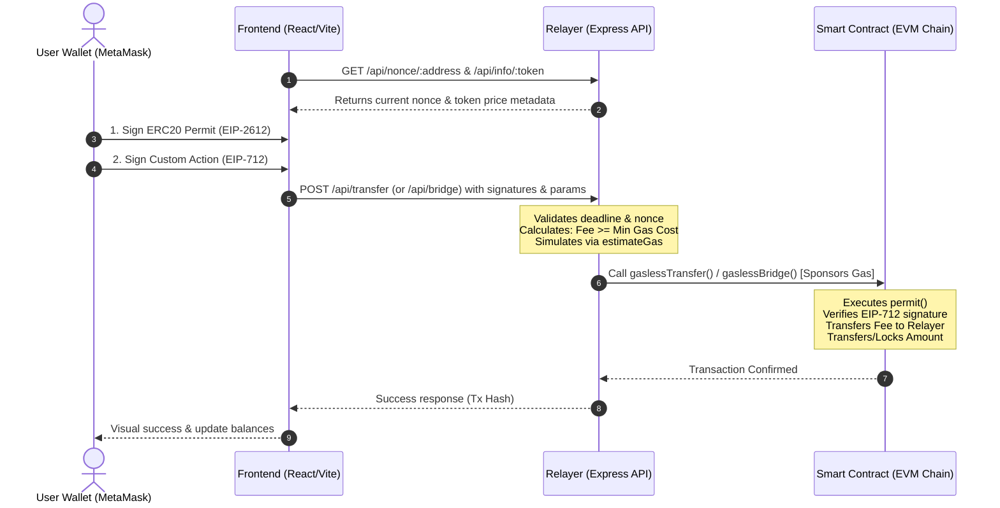

# Abstract Gasless Hub

A complete decentralized, gasless transaction framework that enables users to perform ERC20 token transfers and bridging operations without holding native gas tokens (like ETH). The project utilizes **EIP-2612 (ERC20 Permit)** and custom **EIP-712 typed signatures** to delegate transaction submission and gas sponsorship to an off-chain relayer in exchange for a small token fee.

---

## 🏗️ System Architecture

The project is structured into three main layers: **Frontend**, **Relayer**, and **Smart Contracts**. The architecture is designed to keep the user experience seamless (requiring only signature approvals) while ensuring security, replay protection, and economic alignment for the relayer.



### 1. Frontend Layer (`/frontend`)
*   **Technology**: React.js, Vite, Ethers.js (v6), custom modern CSS styling.
*   **Role**:
    *   **User Interaction**: Provides an interactive dashboard for connecting Web3 wallets (MetaMask), selecting/configuring ERC20 permit tokens, setting gas limits, fees, and destination chains.
    *   **Data Aggregation**: Polls the Relayer API and blockchain to display real-time balances, token decimals, and current user nonces.
    *   **Cryptographic Signature Request**: Instead of dispatching transaction payloads directly to the blockchain, it requests two sequential signatures from the user:
        1.  **ERC20 Permit Signature (EIP-2612)**: Authorizes the bridge contract to spend `amount + fee` tokens of the user.
        2.  **Custom Gasless Action Signature (EIP-712)**: Authorizes either a `GaslessTransfer` or `GaslessBridge` action detailing the exact recipient, amount, fee, destination chain, gas limit, nonce, and deadline.
    *   **Relayer Communication**: Packages the verified signatures and parameters into a structured JSON payload and sends it to the Relayer API endpoints.

### 2. Relayer Layer (`/relayer`)
*   **Technology**: Node.js, Express.js, Ethers.js.
*   **Role**:
    *   **Gas Sponsorship**: Holds a funded Ethereum private key to sign and pay for native transaction gas on behalf of the users.
    *   **Validation Engine**:
        *   **Deadline check**: Verifies the signature has not expired.
        *   **Gas Fee Sanity Check**: Compares the user's offered fee in tokens against the current block base gas price and the user's signed gas limit:
            $$\text{minFeeRequired} = \frac{\text{gasLimit} \times \text{block.basefee} \times 10^{\text{decimals}}}{\text{tokenPriceInWei}}$$
            If the signed fee is lower than the calculated minimum, the transaction is rejected to prevent the Relayer from operating at a loss.
        *   **Transaction Simulation**: Executes an on-chain dry-run using `estimateGas`. If the transaction would revert (e.g. due to double spend, incorrect nonce, or fake signature), the Relayer intercepts and rejects the request, protecting its wallet from wasting gas.
    *   **Transaction Dispatcher**: Submits the valid parameters and signatures to the smart contract, monitors the transaction, and returns the transaction hash to the frontend.

### 3. Smart Contract Layer (`/contracts`)
*   **Technology**: Solidity (v0.8.20), OpenZeppelin, Foundry compiler and deployment framework.
*   **Role**:
    *   **GaslessTransferBridge.sol**: The core gateway contract deployed on the EVM chain.
    *   **On-Chain Token Permit**: Invokes `permit()` on the target ERC20 token using the user's EIP-2612 signature to pull allowance dynamically without a separate approval transaction.
    *   **EIP-712 Action Verification**: Validates the EIP-712 signatures using OpenZeppelin's cryptographical libraries (`ECDSA.recover`) to ensure the parameters were signed by the token owner.
    *   **On-Chain Gas Fee Verification**: Enforces minimum fees inside a custom modifier `validateGasFee` using current on-chain `block.basefee` and token prices, protecting both relayers and users.
    *   **State Operations**:
        *   `gaslessTransfer`: Transfers the user's fee to the Relayer and the transfer amount to the recipient.
        *   `gaslessBridge`: Transfers the user's fee to the Relayer and locks the bridge amount inside the contract.
        *   `release` (Owner-Only): Allows the owner (or bridge oracle/validators) to unlock and release bridged assets to recipients.
    *   **Replay Protection**: Keeps track of completed transactions using a custom user-specific `gaslessNonces` mapping.

---

## 🛠️ Usage & Setup Guide

### 1. Smart Contract Development (Foundry)
Navigate to the root directory to run Foundry actions:

*   **Build contracts**:
    ```shell
    forge build
    ```
*   **Run unit tests**:
    ```shell
    forge test
    ```
*   **Format codebase**:
    ```shell
    forge fmt
    ```
*   **Deploy (Local Anvil example)**:
    Start a local node:
    ```shell
    anvil
    ```
    Deploy the gateway bridge:
    ```shell
    forge script script/Deploy.s.sol --rpc-url http://127.0.0.1:8545 --broadcast --private-key <DEPLOYER_PRIVATE_KEY>
    ```

### 2. Relayer Setup
Navigate to the `/relayer` directory:
1.  Copy `.env.example` to `.env` and fill in:
    *   `RPC_URL`: URL of the Ethereum provider (e.g. `http://127.0.0.1:8545`).
    *   `CONTRACT_ADDRESS`: Address of the deployed `GaslessTransferBridge` contract.
    *   `RELAYER_PRIVATE_KEY`: Private key of the account funding the gas.
2.  Install dependencies and start:
    ```shell
    npm install
    npm start
    ```

### 3. Frontend Setup
Navigate to the `/frontend` directory:
1.  Install dependencies:
    ```shell
    npm install
    ```
2.  Start the local development server:
    ```shell
    npm run dev
    ```
3.  Open `http://localhost:5173` in your browser. Connect MetaMask to your local network (e.g., Anvil chain ID `31337`), load the bridge config, and test transfers/bridging gaslessly!

